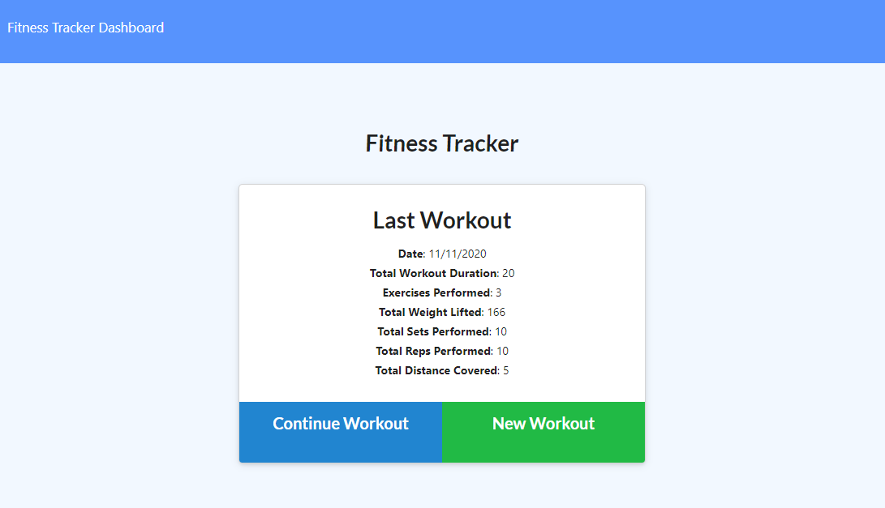
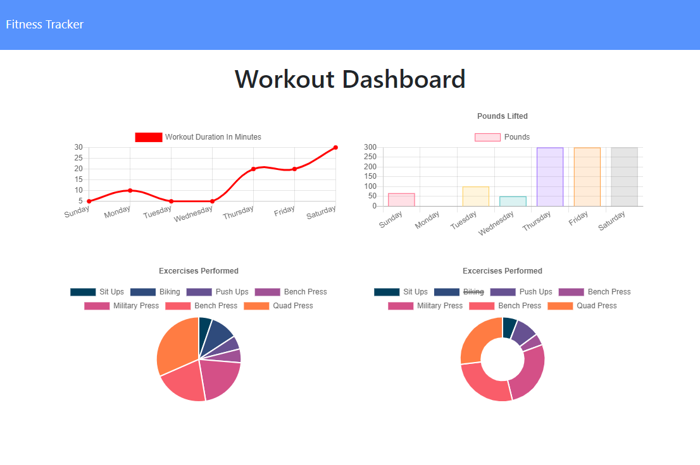

# Workout Tracker
  
  

  ## Table of Contents
  * [**Description**](#description)
  * [**Installation**](#installation)
  * [**Usage**](#usage)
  * [**Contributing**](#contributing)
  * [**Tests**](#tests)
  * [**Support Team**](#support-team)
  * [**License**](#license)
  * [**Questions**](#questions)

  ## Description
  A workout logging webpage with MongoDB, Atlas, Node, and Express. Deployed with Heroku, this project uses a cloud-based database to store the user's fitness data. The user can submit new workouts or add to existing ones, and view their progress in beautiful graphs and pie charts!

  Deployed at: https://shielded-ridge-99283.herokuapp.com/

  Repository: https://github.com/LindseyM20/workout-tracker

  ## Installation
  Commands to run to install dependencies: npm install

  ## Usage
  Use this app to keep track of your workouts, and to stay motivated towards your goals!

  
  

  ## Contributing
  [Contributor Covenant Code of Conduct](https://www.contributor-covenant.org/version/2/0/code_of_conduct/code_of_conduct.md)

  ## Tests
  Command to run tests: N/A
  
  ## Support Team
  Special thanks to: 

  [Amanda Anderson](https://github.com/aanderson120)

  [Brooklynne Audette](https://github.com/B-Audette)

  [Dorotea Flores-Kestner](https://github.com/dfkestner)
  

  ## License
  The contents of this repository are protected under the MIT license

  ## Questions
  Follow me on GitHub at https://github.com/LindseyM20

  Please contact me with any questions or feedback at lindsey.bordner@gmail.com 
